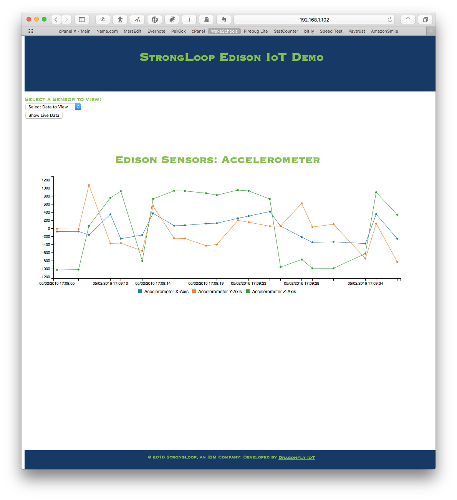

# StrongLoop IoT Demo

###This is a [LoopBack](http://loopback.io) Application, developed using [StrongLoop](https://github.com/strongloop) for demostrating the connection of StrongLoop to the Internet of Things.

##Required Hardware:
* [Intel Edison](https://www.sparkfun.com/products/13024) Module
* [Sparkfun 9-Degrees of Freedom Block](https://www.sparkfun.com/products/13033)
* [Sparkfun Base Block](https://www.sparkfun.com/products/13045)
* [Sparkfun Battery Block](https://www.sparkfun.com/products/13037)
* USB Mini-C cable

##Required Hardware:
* This Code
* [Sensor Application](https://github.com/davidgs/LSM9DS0)
* [MongoDB](http://mongodb.org)
    * [MongoDB C-Libraries](https://github.com/mongodb/mongo-c-driver)
* [Configuration and Build Scripts](https://github.com/davidgs/Config-Scripts)

##How it works:

The sensor reading application is a native C program that runs locally on the Intel Edison device and reads the 9-Degrees of Freedom board mentioned above.
It then inserts these values to the Mongo DB instance as JSON objects via the StrongLoop APIs.
The StrongLoop APIs then make this data available to the client application vi a series of web pages that graph and display the sensor readings.

Notice the 'Show Live Data' button in the upper left corner. Clicking this button causes the page stream live data from the device to the graph in real-time.

##Running the Demo
###First, You'll need to install the [Configuration Scripts](https://github.com/davidgs/Config-Scripts) on your device
###Make sure you read that project carefully to get your Intel Edison properly set up. Once that's done:
* Almost all of the required processes are already running on the Edison!   
* If you've previously run the Demo, click the "Reset MongoDB" button above to clear out the data store so it doesn't grow too large.   
* Click the "Restart Sensor Logger" Button above to start the sensor logging process.   
* Choose a Sensor or set of sensors to view from the pull-down menu above.  
* You can return to The Home Page any time to restart the sensor logger or the Mongo DB processes   
* If you want to run things manually, or you're having trouble with the above buttons then:   
    * Log in to the Intel Edison via ssh using Username: root Password: DemoDemo   
    * Run the script demo-ctrl.sh in the root user's home with the following available options:   
        * start: Start all the necessary processes (restarts them if they are running)   
        * stop: Stop all the running processes for the Demo.   
        * update: Make sure that all the packages required for the demo are up to date from GitHub   
        * clear: Clear out the Mongo DB datastrore.   
* Try moving the sensor around a lot and then load data to get the best views.   

